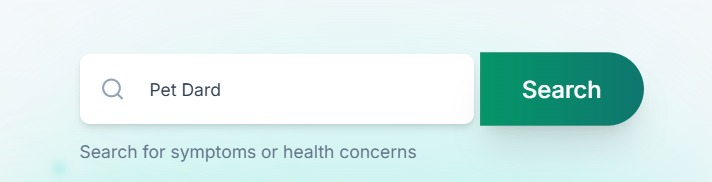
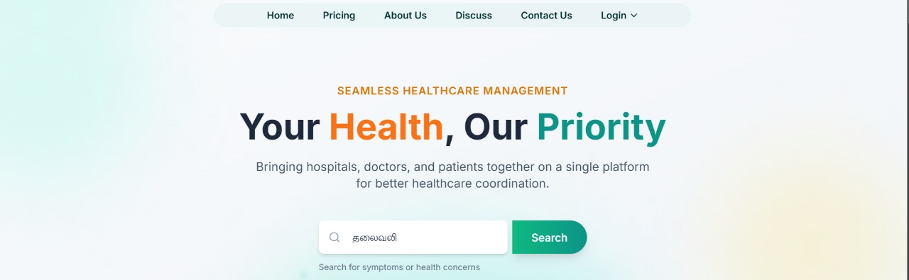

# 🩺 HealthSync

  <h3>A next-generation healthcare management platform</h3>
  
Streamlining patient-doctor interactions, optimizing hospital operations, and enhancing patient care through AI-driven features.

  
  
  
  
 

---

## 📋 Table of Contents
- [Overview](#overview)
- [Core Features](#core-features)
- [AI-Powered Capabilities](#ai-powered-capabilities)
- [Patient-Centered Tools](#patient-centered-tools)
- [Hospital Management](#hospital-management)
- [Tech Stack](#tech-stack)
- [Installation](#installation)
- [Usage](#usage)
- [Contributing](#contributing)

---

## 🔍 Overview

HealthSync is a comprehensive healthcare platform built with modern web technologies, designed to connect patients with healthcare providers seamlessly while providing powerful tools for hospitals to manage their operations efficiently.

---

## 💫 Core Features

### 🏥 Doctor-Patient Consultation Booking
- *Online & Offline Appointments*: Schedule both in-person and virtual consultations
- *Video Call Integration*: Secure, HIPAA-compliant video consultations
- *Smart Scheduling*: AI-powered appointment suggestions based on urgency and availability

Secure video consultation interface

### 📌 OPD Queuing System
- *Real-time Queue Updates*: Live tracking of outpatient department waiting times
- *Digital Queue Management*: Paperless queue system with SMS notifications
- *Priority-based Sorting*: Emergency cases automatically prioritized

  

    
    
<em>Hospital queue management dashboard</em>

  

  

    
    
<em>Doctor's queue management interface</em>

  

---

## 🤖 AI-Powered Capabilities

### 🔎 Semantic Search
- *Multilingual Symptom Search*: Search medical conditions in any language
- *Natural Language Processing*: AI interprets symptoms and suggests relevant results
- *Context-Aware Results*: Personalized search results based on patient history

  

    
    
<em>Symptom search in English</em>

  

  

    
    
<em>Symptom search in Tamil</em>

  

### 🤖 Curo AI - Medical Assistant

Intelligent healthcare assistance available in two tiers:

| *CuroBeat* (Premium) | *CuroFlash* (Free) |
|------------------------|----------------------|
| ✅ Structured medical data generation | ✅ Real-time medical information stream |
| ✅ Personalized health insights | ✅ General health education |
| ✅ Integration with medical records | ✅ Basic symptom assessment |
| ✅ Advanced analytics and trends | ✅ Public health resources |

CuroBeat interface for structured medical data analysis

CuroFlash providing real-time streaming medical information

### 🏅 CuroHero (Coming Soon)
- *Human Medical Assistants*: Connect with trained healthcare professionals
- *Specialized Support*: Assistance for elderly, chronic conditions, and post-surgery recovery
- *24/7 Availability*: Round-the-clock access to medical guidance

---

## 👤 Patient-Centered Tools

### 📂 Patient History & Digital Records
- *Unified Medical Records*: Comprehensive storage of medical history
- *Prescription Management*: Digital generation and delivery of prescriptions
- *Document Sharing*: Secure sharing of reports with authorized healthcare providers

Patient profile showing comprehensive medical history and records

### ⏰ Appointment & Medicine Reminders
- *Smart Notifications*: Timely reminders for appointments and medications
- *Dosage Tracking*: Monitor medication adherence and schedule
- *Follow-up Reminders*: Automated follow-up scheduling suggestions

### 🌎 Multilingual Support
- *Google Translate Integration*: Platform available in multiple languages
- *Cultural Adaptations*: Region-specific health information and guidance
- *Voice Input*: Multilingual voice recognition for accessibility

Main dashboard with multilingual support enabled

---

## 🏨 Hospital Management

### 🚨 Emergency Notification System (Coming Soon)
- *Critical Alerts*: Instant notifications for emergencies
- *Family Coordination*: Automated updates to designated family members
- *First Responder Integration*: Direct communication with emergency services

### 🏨 Bed Allocation & Management
- *Real-time Availability*: Live tracking of hospital bed occupancy
- *Optimized Allocation*: AI-driven bed assignment based on patient needs
- *Predictive Occupancy*: Forecasting of bed requirements for better planning

Hospital room and bed availability management dashboard

### 💳 Integrated Billing System
- *Transparent Pricing*: Clear breakdown of medical costs
- *Multiple Payment Options*: Online, offline, and insurance processing
- *Automated Insurance Claims*: Streamlined submission to insurance providers

---

## 🛠 Tech Stack

| Category | Technologies |
|----------|--------------|
| *Frontend* | Next.js, TypeScript, ShadCN UI |
| *UI/UX* | Framer Motion, Lucide React |
| *Backend* | Node.js, Express.js |
| *Database* | MongoDB, Redis |
| *Authentication* | NextAuth.js, JWT |
| *AI/ML* | TensorFlow.js, OpenAI API |
| *DevOps* | Docker, GitHub Actions, Vercel |

---

## 🚀 Installation

### Prerequisites
- Node.js (v16+)
- Yarn or npm
- Environment variables (see .env.example)

### Setup Instructions

1. *Clone the repository*
   bash
   git clone https://github.com/your-repo/healthsync.git
   cd healthsync
   

2. *Install dependencies*
   bash
   yarn install
   # or
   npm install
   

3. *Configure environment variables*
   bash
   cp .env.example .env.local
   # Edit .env.local with your configuration
   

4. *Run the development server*
   bash
   yarn dev
   # or
   npm run dev
   

5. *Open your browser*
   Navigate to [http://localhost:3000](http://localhost:3000)

---

## 🤝 Contributing

We welcome contributions to HealthSync! Please see our [CONTRIBUTING.md](CONTRIBUTING.md) for guidelines.

---

## 📄 License

HealthSync is licensed under the MIT License - see the [LICENSE](LICENSE) file for details.

---

  
Made with ⤠for healthcare professionals and patients worldwide

  
© 2025 HealthSync Team

